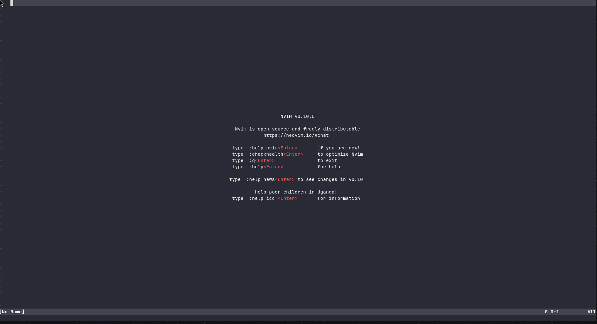

- [Modvim](#modvim)
    - [Installation](#installation)
    - [Screenshots](#screenshots)
    - [Auto Brackets](#auto-brackets)

# Modvim

## Installation
```
git clone https://github.com/thatqui/modvim.git ~/.config/nvim && nvim
```

## Screenshots


## Plugins

### Theme
- I am using Dracula as my theme.

### LSP
- I am using `mason.nvim`, `mason-lspconfig.nvim`, `nvim-lspconfig` for LSP.

### Auto Brackets
- I am using `jiangmiao/auto-pairs`.
